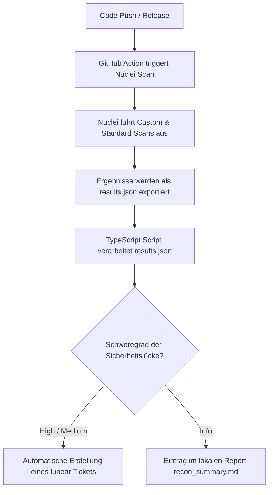

# Sicherheitskonzept: Automatisierte Pentest-Pipeline mit Nuclei & Linear

Dieses Dokument beschreibt das Konzept, den Projektplan, die Machbarkeit und die Integration einer kontinuierlichen Sicherheitsüberprüfung der Panos.ai Infrastruktur mittels **Nuclei** und **Linear**.

---

## 1. Scope (Geltungsbereich) & Machbarkeit

### Scope
Der Fokus der automatisierten Scans liegt auf drei Hauptbereichen der Panos.ai Infrastruktur:
1. **Frontend (Next.js / Supastarter Template):**
   - Schutz vor dem Leaken von `.env`-Dateien in Produktion.
   - Entdecken von Source Maps (`.js.map`), die internen Code offenlegen.
   - Erkennung von API-Token-Leaks in clientseitigen JavaScript-Bundles.
2. **Backend API (Hono):**
   - Überprüfung auf CORS-Fehlkonfigurationen (`Access-Control-Allow-Origin: *`).
   - Fehlende oder unvollständige Security-Header (HSTS, CSP, X-Content-Type-Options).
   - Fuzzing von Endpunkten auf unautorisierten Zugriff.
3. **Cloud Infrastructure (AWS & Third-Party):**
   - Prüfung auf öffentlich exponierte S3-Buckets.
   - Subdomain Takeovers (Route 53 / Amplify).
   - Sicherheitslücken in genutzten Drittanbieter-Tools (z. B. Metabase RCE-Schachstellen).

### Machbarkeit
- **Technisch einfach umsetzbar:** Nuclei benötigt keine Agenten-Installationen auf den Zielsystemen. Es läuft als schlankes CLI-Tool, das HTTP-Anfragen sendet.
- **CI/CD-Integration:** Da Nuclei als Docker-Image oder über GitHub Actions ausführbar ist, kann es nahtlos in bestehende Deployments integriert werden.
- **Ressourcenschonend:** Scans dauern in der Regel unter 2 Minuten, da Profile auf den spezifischen Tech-Stack (Next.js, Hono, AWS) zugeschnitten sind (Ausschluss irrelevanter Scans wie WordPress oder PHP).

---

## 2. Warum das Tool "Nuclei"?

Nuclei bietet im Vergleich zu klassischen Sicherheits-Scannern entscheidende Vorteile:
- **Deklarative YAML-Templates:** Sicherheitsprüfungen werden als YAML-Dateien geschrieben. Das macht sie extrem lesbar für Entwickler und leicht erweiterbar.
- **Geschwindigkeit & Effizienz:** In Go geschrieben und auf massiv parallele Netzwerkzugriffe optimiert.
- **Hohe Anpassbarkeit:** Wir können eigene Regeln schreiben, die exakt zu unserem Code-Muster passen (z. B. Suche nach dem spezifischen Muster von Linear-API-Schlüsseln `lin_api_*`).
- **Pipeline-Kompatibilität:** Nuclei gibt strukturierte JSON-Dateien aus, die einfach per Script (Node.js/TypeScript) verarbeitet und in andere Tools (wie Linear) importiert werden können.

---

## 3. NIST Cybersecurity Framework (CSF) Alignment

Die Implementierung dieser Pipeline trägt direkt zur Einhaltung des **NIST CSF (Version 2.0)** bei:

```
┌────────────────────────────────────────────────────────┐
│                   NIST CSF ALIGNMENT                   │
├──────────────┬──────────────┬──────────────┬───────────┤
│   IDENTIFY   │   PROTECT    │    DETECT    │  RESPOND  │
│ (Identität)  │   (Schutz)   │ (Erkennung)  │(Reaktion) │
└──────┬───────└──────┬───────└──────┬───────└─────┬─────┘
       │              │              │             │
       ▼              ▼              ▼             ▼
  Sicherheits-   Verhinderung   Regelmäßige   Automatische
  Lücken im      von Secrets-   Scans in der  Ticket-Erstellung
  Tech-Stack     Leaks in       CI/CD-        in Linear für
  erkennen       JS-Bundles     Pipeline      schnellen Fix
```

* **Identify (ID):** Wir identifizieren Schwachstellen und Fehlkonfigurationen in unseren Assets (Next.js, Hono, AWS) und priorisieren sie nach Schweregrad.
* **Protect (PR):** Durch das Scannen von Client-Bundles verhindern wir aktiv, dass sensible API-Schlüssel (z. B. AWS, Hubspot, Linear) nach außen dringen.
* **Detect (DE):** Kontinuierliche Sicherheitsüberprüfungen als Teil des CI/CD-Prozesses erkennen Schwachstellen sofort bei jedem neuen Release.
* **Respond (RS):** Die direkte Integration mit Linear sorgt für eine sofortige Eskalation an das Entwickler-Team. Gefundene Schwachstellen werden automatisch in das Entwickler-Board eingepflegt.

---

## 4. Projekt-Struktur & Implementierung

### Struktur des Repositories
Die Integration wird in einem dedizierten Git-Repository verwaltet:
```
panos-ai-pentest/
├── .github/workflows/      # GitHub Actions Workflows für automatisierte Scans
├── templates/              # Custom Nuclei Templates (YAML)
│   ├── js-bundle-token-leakage.yaml
│   ├── panos-hono-security-headers.yaml
│   └── panos-nextjs-config-leak.yaml
├── scripts/                # Hilfsscripte für Automatisierung & Integration
│   ├── nuclei-to-linear.ts # Parser & Linear-Ticket-Erstellung
│   └── list-teams.ts       # Utility zur Konfiguration von Linear-Teams
├── package.json            # Node.js Abhängigkeiten (Linear SDK, TS-Node)
└── .gitignore              # Schutz von lokalen Testergebnissen und .env-Dateien
```

### Implementierungs-Workflow (CI/CD)



---

## 5. Ergebnisse & Verwertung

Um Ticket-Spam im Entwickler-Board zu vermeiden, werden die Ergebnisse von Nuclei intelligent aufgeteilt:

1. **Kritische Befunde (High / Medium / Critical):**
   - Jede relevante Schwachstelle wird automatisch in Linear als Ticket angelegt.
   - **Deduplizierung:** Das Script prüft vor der Erstellung, ob bereits ein offenes Ticket mit demselben Titel existiert, um doppelte Aufgaben zu vermeiden.
2. **Informative Befunde (Info / Low):**
   - Werden nicht in Linear eingepflegt.
   - Stattdessen werden sie in einer lokalen Datei namens `recon_summary.md` gesammelt, um dem Sicherheitsteam Übersicht über offene Ports, Serverversionen und Technologien zu geben.

---

## 6. Projektplan & Meilensteine (3-Wochen-Plan)

Für die Überwachung des Bearbeitungsfortschritts wurden entsprechende Issues im Linear-Board angelegt:

### Woche 1: Fundament & Scoping
* **Meilenstein 1.1: Nuclei CLI Setup & Basics**
  - Installation und grundlegendes Verständnis der CLI-Parameter.
* **Meilenstein 1.2: Scope-Definition & Target-Liste**
  - Definition der Staging-Umgebungen und zu testenden URLs.
* **Meilenstein 1.3: Baseline Scan & Filterung**
  - Erster vollständiger Durchlauf und Analyse von False Positives.

### Woche 2: Custom Templates & Tech-Stack-Fokus
* **Meilenstein 2.1: Next.js & Supastarter Templates**
  - Erstellung von Templates für exponierte Konfigurationsdateien und JS-Bundles.
* **Meilenstein 2.2: Hono API Security-Header & CORS**
  - Erstellung von Templates zur Überprüfung der Backend-Sicherheitsarchitektur.
* **Meilenstein 2.3: Cloud Infrastruktur-Scans**
  - Metabase CVE-Scans und AWS-S3-Bucket-Prüfungen.

### Woche 3: Automatisierung & Linear-Integration
* **Meilenstein 3.1: Parsing & Filtering Script**
  - Entwicklung des Skripts zur Strukturierung der JSON-Outputs.
* **Meilenstein 3.2: Linear SDK & Deduplizierung**
  - Anbindung an das Linear-Board und Schutz vor doppelten Tickets.
* **Meilenstein 3.3: CI/CD-Pipeline Automation**
  - Integration als GitHub Action für regelmäßige automatische Scans.
* **Meilenstein 3.4: Dokumentation & Abschlusspräsentation**
  - Erstellung des Benutzerhandbuchs und Vorstellung des Systems.
