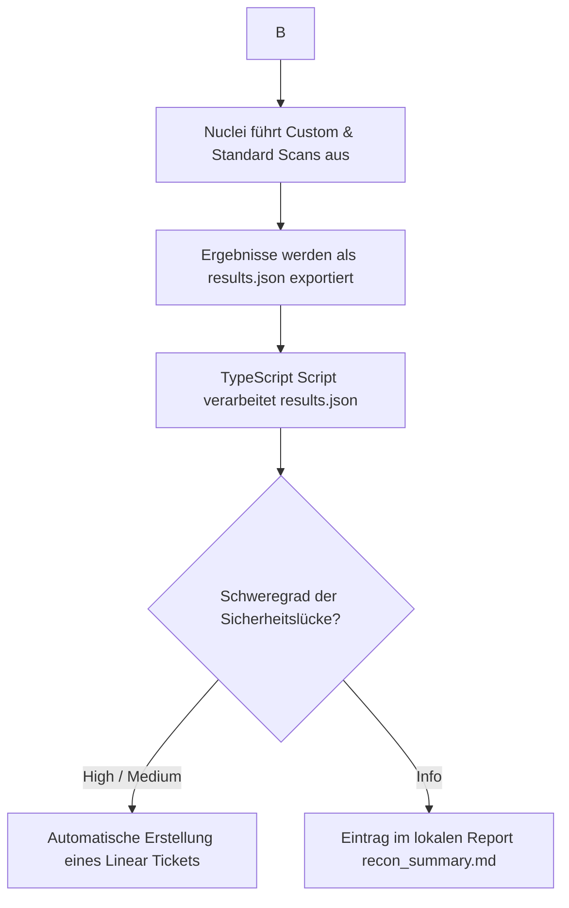

# Sicherheitskonzept: Automatisierte Pentest-Pipeline (EINT-103) mit Nuclei & Linear

Dieses Dokument beschreibt das Konzept, den Projektplan, die Machbarkeit und die Integration einer kontinuierlichen Sicherheitsüberprüfung der Panos.ai Infrastruktur mittels **Nuclei** und **Linear** im Rahmen des Tickets **EINT-103**.

---

## 1. Scope (Geltungsbereich) & Machbarkeit

### Scope
Der Fokus der automatisierten Scans liegt auf der über das Netzwerk erreichbaren AWS-Staging-Deployment-Infrastruktur. Dieser Scope ist eng auf das OWASP-ZAP-Setup abgestimmt und beschränkt sich ausschließlich auf aktive Netzwerkscans der bereitgestellten Staging-Websites und APIs.
Folgendes ist explizit **nicht** im Scope:
- Scannen von lokalem Next.js Quellcode.
- Clientseitige statische Quellcodeanalyse (wie z. B. das Extrahieren von Source-Maps direkt aus dem Quellcode).
- Metabase-Instanzen (nicht Teil dieses Staging-Tech-Stacks).

Der Scan-Fokus liegt somit auf:
- Überprüfung der AWS-Staging-Endpoints auf CORS-Fehlkonfigurationen (`Access-Control-Allow-Origin: *`).
- Fehlende oder unvollständige Security-Header (HSTS, CSP, X-Content-Type-Options) der Webanwendungen.
- Netzwerkbasierte Suche nach öffentlich exponierten Dateien (z. B. `.env`-Dateien, die über HTTP/HTTPS auf dem Webserver abrufbar sind).

### Machbarkeit
- **Technisch einfach umsetzbar:** Nuclei benötigt keine Agenten-Installationen auf den Zielsystemen. Es läuft als schlankes CLI-Tool, das HTTP-Anfragen sendet.
- **Lokale & CI/CD-Integration:** Da Nuclei als schlankes CLI-Tool, Docker-Image oder GitHub Action ausführbar ist, kann es flexibel integriert und sowohl automatisiert als auch manuell lokal gestartet werden.
- **Ressourcenschonend:** Scans dauern in der Regel unter 2 Minuten, da Profile auf die Netzwerk-Endpoints der AWS-Staging-Umgebung zugeschnitten sind (Ausschluss irrelevanter Scans wie WordPress oder PHP).

> [!IMPORTANT]
> **Staging-Fokus:**
> Sicherheitsüberprüfungen mittels Nuclei werden **ausschließlich** auf Staging-Umgebungen durchgeführt. Das Ausführen aktiver Scans gegen Produktionsumgebungen ist untersagt, um die Systemverfügbarkeit der Live-Anwendung nicht zu beeinträchtigen.

---

## 2. Warum das Tool "Nuclei"?

Nuclei bietet im Vergleich zu klassischen Sicherheits-Scannern entscheidende Vorteile:
- **Deklarative YAML-Templates:** Sicherheitsprüfungen werden als YAML-Dateien geschrieben. Das macht sie extrem lesbar für Entwickler und leicht erweiterbar.
- **Geschwindigkeit & Effizienz:** In Go geschrieben und auf massiv parallele Netzwerkzugriffe optimiert.
- **Hohe Anpassbarkeit:** Wir können eigene Regeln schreiben, die exakt zu unserem Code-Muster passen (z. B. Suche nach dem spezifischen Muster von Linear-API-Schlüsseln `lin_api_*`).
- **Pipeline-Kompatibilität:** Nuclei gibt strukturierte JSON-Dateien aus, die einfach per Script (Node.js/TypeScript) verarbeitet und in andere Tools (wie Linear) importiert werden können.

---

## 3. NIST Cybersecurity Framework (CSF) Alignment

Die Implementierung dieser Pipeline trägt direkt zur Einhaltung des **NIST CSF (Version 2.0)** bei:

```
┌────────────────────────────────────────────────────────┐
│                   NIST CSF ALIGNMENT                   │
├──────────────┬──────────────┬──────────────┬───────────┤
│   IDENTIFY   │   PROTECT    │    DETECT    │  RESPOND  │
│ (Identität)  │   (Schutz)   │ (Erkennung)  │(Reaktion) │
└──────┬───────└──────┬───────└──────┬───────└─────┬─────┘
       │              │              │             │
       ▼              ▼              ▼             ▼
  Sicherheits-   Verhinderung   Regelmäßige   Automatische
  Lücken im      von Secrets-   Scans in der  Ticket-Erstellung
  Tech-Stack     Leaks in       CI/CD-        in Linear für
  erkennen       JS-Bundles     Pipeline      schnellen Fix
```

* **Identify (ID):** Wir identifizieren Schwachstellen und Fehlkonfigurationen in unseren Assets (Next.js, Hono, AWS) und priorisieren sie nach Schweregrad.
* **Protect (PR):** Durch das Scannen von Client-Bundles verhindern wir aktiv, dass sensible API-Schlüssel (z. B. AWS, Hubspot, Linear) nach außen dringen.
* **Detect (DE):** Kontinuierliche Sicherheitsüberprüfungen als Teil des CI/CD-Prozesses erkennen Schwachstellen sofort bei jedem neuen Release.
* **Respond (RS):** Die direkte Integration mit Linear sorgt für eine sofortige Escalation an das Entwickler-Team. Gefundene Schwachstellen werden automatisch in das Entwickler-Board eingepflegt.

---

## 4. Secrets-Management, Autorisierung, Lokale Ausführung & Rechtlicher Rahmen

### Secrets-Management & Lokale Ausführung (Offline-Resilienz)
Zur Absicherung der sensiblen API-Schlüssel werden folgende Standards implementiert:
- **GitHub Secrets:** Anmeldedaten wie der `LINEAR_API_KEY` und die `LINEAR_TEAM_ID` werden als verschlüsselte Repository-Secrets in GitHub Actions hinterlegt.
- **Lokale Ausführung & Offline-Resilienz (WICHTIG):** Falls der Owner (Frank) nicht verfügbar ist, um API-Keys zu generieren, GitHub Secrets anzupassen oder GitHub-Action-Pipelines freizugeben, wird das System so ausgelegt, dass es vollständig **lokal auf den Geräten der Interns** ausgeführt werden kann. Die Ausführung erfolgt dann wie folgt:
  - Interns generieren persönliche Developer-Tokens in ihren eigenen Linear-Accounts.
  - Diese Keys werden lokal in einer `.env`-Datei eingetragen (die über `.gitignore` vom Git-Verlauf ausgeschlossen ist).
  - Der Scan wird lokal via Nuclei-CLI ausgeführt und das Sync-Skript manuell über `npm run sync-tickets` gestartet.
  - Das System läuft somit vollkommen autark und benötigt keine Freigaben oder CI/CD-Infrastruktur des Owners.

### Empfohlener AWS OIDC-Workflow
Um langfristige AWS-Zugangsdaten (AWS Access Key ID & Secret Access Key) zu vermeiden, empfehlen wir für AWS-Infrastrukturprüfungen den **AWS OIDC (OpenID Connect) Workflow**:
- GitHub Actions authentifiziert sich direkt über einen vordefinierten OpenID Connect Identity Provider bei AWS IAM.
- GitHub Actions fordert eine kurzlebige, temporäre Session-Rolle (AssumeRoleWithWebIdentity) an.
- Diese Rolle besitzt ausschließlich Leserechte (ReadOnly) auf die zu überprüfenden Ressourcen. Dadurch entfällt das Risiko von credential leaks vollständig.

### Rechtlicher Rahmen
- **Owner Consent & Scope:** Automatisierte Scans dürfen rechtlich nur gegen Server und domains ausgeführt werden, für die Panos.ai die explizite Eigentümerschaft besitzt und für die ein schriftliches Einverständnis der Geschäftsführung / des CTOs vorliegt.
- **Konformität (Deutschland/EU):** Unberechtigtes Scannen fremder Systeme fällt unter § 202a StGB (Ausspähen von Daten) oder entsprechende EU-Richtlinien. Unsere Pipeline läuft durch die Beschränkung auf eigene Staging-Umgebungen in einem sicheren, legalen Rahmen.

---

## 5. Projekt-Struktur (Alignment mit `ext-interns-cybersecurity` & @rené)

Um eine saubere Abgrenzung zwischen den verschiedenen Sicherheits-Tools (z. B. Nuclei, ZAP, Nmap) bezüglich Konfiguration, Dokumentation und versioniertem Output zu gewährleisten, erfolgt die Integration in die Verzeichnisstruktur des zentralen `ext-interns-cybersecurity`-Repositorys wie folgt:

```
ext-interns-cybersecurity/
├── .github/
│   └── workflows/
│       ├── nuclei-security-scan.yml    # Dedizierter Workflow für Nuclei-Scans
│       └── zap-security-scan.yml       # ZAP-Scans (separat gesteuert)
└── 2_Identify/
    └── ID.RA-1_Risk_Assessment/
        └── Pentesting/
            ├── README.md               # Gesamt-Dokumentation aller Pentest-Tools
            └── nuclei/                 # Ordner für alle Nuclei-Assets
                ├── README.md           # Setup-Anleitung für Nuclei & lokale Ausführung
                ├── package.json
                ├── tsconfig.json
                ├── .gitignore          # Ignoriert lokale .env und temporäre Dateien
                ├── templates/          # Custom YAML-Templates (AWS-Staging-Fokus)
                │   ├── panos-hono-security-headers.yaml  # Scannt Header (HSTS, CSP, CORS)
                │   └── panos-nextjs-config-leak.yaml     # Prüft exponierte .env Dateien über HTTP
                ├── upload/             # Integrations- & Parser-Skripte für Ticket-Upload
                │   ├── nuclei-to-linear.ts               # Parser & Sync-Logik (mit Auto-Close)
                │   ├── list-teams.ts                     # Hilfsskript für Team-IDs
                │   └── create-milestone-issues.ts        # Hilfsskript für Meilenstein-Tickets
                └── outputs/            # Versionierte Scan-Reports (Run-by-Run)
                    ├── .gitkeep
                    └── scan_YYYY-MM-DD_HH-mm-ss/         # Zeitstempel-Ordner eines Runs
                        ├── results.json                  # Roher Nuclei-Scan-Output dieses Runs
                        └── recon_summary.md              # Info-Findings dieses Runs als MD-Report
```

### Vorteile dieser Struktur (Abstimmung mit @rené):
- **Kein Tool-Clutter:** Alle Configs, Parser und Templates liegen isoliert im `nuclei/`-Unterordner und stören andere Tools nicht.
- **Saubere Upload-Abgrenzung:** Die Upload- & Integrationslogik ist im Ordner `upload/` gebündelt und klar getrennt von den Scans.
- **Versionierter Output (Outputs-Ordner):** Statt einer einzigen `recon_summary.md` im Projekt-Root wird für jeden Durchlauf ein eigener Unterordner mit Zeitstempel unter `outputs/` angelegt. So gehen historische Ergebnisse nicht verloren und die Berichte bleiben übersichtlich.

### Implementierungs-Workflow



---

## 6. Ergebnisse, Verwertung, CI/CD-Gating & Linear Ticket Lifecycle

Um Ticket-Spam im Entwickler-Board zu vermeiden und kritische Releases abzusichern, werden Ergebnisse von Nuclei anhand der folgenden Matrix bewertet:

### CI/CD-Gating-Tabelle

| Schweregrad (Severity) | Exit-Code | Build-Status | Aktion (Linear / Reporting) | Dringlichkeit (SLA) |
| :--- | :---: | :--- | :--- | :--- |
| **Critical** | `1` | ❌ Blockiert (Hard Fail) | Ticket-Erstellung in Linear | Sofortige Behebung (< 24 Std.) |
| **High** | `1` | ❌ Blockiert (Hard Fail) | Ticket-Erstellung in Linear | Behebung innerhalb von 3 Tagen |
| **Medium** | `0` | ⚠️ Warnung (Soft Fail) | Ticket-Erstellung in Linear | Behebung im nächsten Sprint |
| **Low** | `0` | ✅ Erfolgreich | Ticket-Erstellung in Linear | Backlog-Triage |
| **Info** | `0` | ✅ Erfolgreich | Eintrag in `outputs/scan_timestamp/recon_summary.md` | Keine Behebung erforderlich |

---

### Detaillierter Linear Ticket Lifecycle (Ticket-Management)

Die Schnittstelle zwischen der automatisierten Pentest-Pipeline und dem Linear-Entwicklungsboard von Panos.ai folgt einem klaren Lifecycle, der über das Sync-Skript `nuclei-to-linear.ts` gesteuert wird:

1. **Ziel-Board / Team-Zuordnung:**
   - Alle Tickets werden in dem durch `LINEAR_TEAM_ID` definierten Board angelegt (z. B. ein separates Security-Board oder direkt das Haupt-Entwicklungs-Board).
2. **Ticket-Erstellung (Format & Inhalt):**
   - **Titel:** Eindeutiges Format: `[Nuclei] <Vulnerability Name> an <Target URL>` (z. B. `[Nuclei] Missing HSTS Header an https://staging.panos.ai`).
   - **Beschreibung:** Beinhaltet den exakten Schweregrad (Critical, High, Medium, Low), die betroffene URL, den Namen des ausgelösten Nuclei-Templates, eine Beschreibung der Schwachstelle sowie eventuell extrahierte Daten (z. B. fehlerhafte Header-Werte).
   - **Prioritäts-Mapping:** Severity-Klassen werden auf die standardisierten Linear-Prioritäten gemappt:
     - `Critical` $\rightarrow$ Priority `1` (Urgent)
     - `High` $\rightarrow$ Priority `2` (High)
     - `Medium` $\rightarrow$ Priority `3` (Normal)
     - `Low` $\rightarrow$ Priority `4` (Low)
   - **Status:** Neu angelegte Tickets starten standardmäßig im Status `Todo` (oder im team-spezifischen Triage-Status).
3. **Deduplizierung (Verhinderung von Ticket-Spam):**
   - Vor dem Anlegen eines Tickets fragt das Skript alle noch nicht abgeschlossenen (aktiven) Issues der Team-ID ab.
   - Existiert bereits ein Ticket mit exakt demselben Titel, wird kein neues Ticket erstellt.
4. **Automatischer Ticket-Abschluss (Auto-Close bei Behebung):**
   - Das Sync-Skript vergleicht bei jedem Run die aktuell aktiven `[Nuclei]` Tickets in Linear mit den im aktuellen Scan gefundenen aktiven Schwachstellen.
   - Wird ein in Linear noch offenes Ticket im aktuellen Scan **nicht mehr gefunden**, wird dies als erfolgreiche Behebung gewertet.
   - Das Skript sucht nach dem `completed`-Workflow-Status des Linear-Teams und verschiebt das Ticket automatisch in diesen Status (z. B. `Done` / `Completed`).
   - Dadurch ist sichergestellt, dass das Entwickler-Board stets den aktuellen Sicherheitszustand widerspiegelt, ohne dass Entwickler Tickets nach einem Fix manuell schließen müssen.

---

## 7. Projektplan & Meilensteine (Aktivitäten für EINT-103)

Für die Überwachung des Bearbeitungsfortschritts der verbleibenden Wochen deines Praktikums wurden die folgenden Meilensteine in Linear angelegt:

### Woche 1: Fundament & Scoping (AWS Staging Focus)
* **Meilenstein 1.1: Nuclei CLI Setup & Basics**
  - Installation und Verständnis der CLI-Parameter für Netzwerktests.
* **Meilenstein 1.2: Scope-Definition & Target-Liste (AWS Staging)**
  - Festlegung der Staging-IP-Bereiche und AWS-Domains. Ausschluss von lokalem Source Code / Metabase aus dem Scoping.
* **Meilenstein 1.3: Baseline Scan & Filterung**
  - Erster vollständiger Durchlauf gegen die Staging-Infrastruktur und Filterung von False Positives.

### Woche 2: Custom Templates für Netzwerk-Audits (AWS Deployment)
* **Meilenstein 2.1: HTTP Config Exposure Templates**
  - Schreiben von YAML-Regeln zur Entdeckung exponierter Konfigurationsdateien (z. B. `.env` Check) über HTTP/HTTPS an den Staging-Targets.
* **Meilenstein 2.2: Hono API & Web-Security Headers**
  - Templates zur Prüfung fehlender oder unvollständiger HTTP-Security-Header (HSTS, CSP) und CORS-Fehlkonfigurationen.
* **Meilenstein 2.3: Port- & Netzwerkdienst-Scans**
  - Auditierung offener Ports und exponierter Netzwerkdienste im AWS Staging (Ausschluss Metabase/interne Subnetze).

### Woche 3: Automatisierung, Linear Lifecycle & Versionierter Output
* **Meilenstein 3.1: Skript-Entwicklung für Versionierung & Parsing**
  - Schreiben des Node.js/TypeScript-Skripts zur Erstellung zeitgestempelter Ordner unter `outputs/scan_timestamp/` mit JSON- und MD-Dateien.
* **Meilenstein 3.2: Linear Lifecycle Integration (Auto-Close & Sync)**
  - Entwicklung der SDK-Anbindung zur automatischen Ticket-Erstellung (Deduplizierung) und automatischen Ticket-Schließung behobener Vulnerabilities.
* **Meilenstein 3.3: Pipeline & Lokaler Run Setup**
  - Dokumentation und Konfiguration des lokalen Fallbacks (Ausführung durch Interns mittels eigener .env / API-Keys bei Abwesenheit des Owners).
* **Meilenstein 3.4: Dokumentation & Abschlusspräsentation**
  - Vervollständigung der README-Dateien, Übergabe der custom templates und Endpräsentation.

---

## 8. Go-Live-Checkliste

Vor dem vollständigen Rollout der Pentest-Pipeline in der CI/CD-Pipeline müssen die folgenden Schritte abgearbeitet sein:

- [ ] **1. Schriftliche Freigabe (CTO/Management):** Einholen der formellen Genehmigung für das Scannen der definierten Domains.
- [ ] **2. Targets verifizieren:** Bestätigen, dass ausschließlich Staging-Endpunkte in der Target-Liste hinterlegt sind (Ausschluss der Produktions-Targets).
- [ ] **3. Secrets in GitHub hinterlegen:** Speichern des `LINEAR_API_KEY` und der `LINEAR_TEAM_ID` in den verschlüsselten GitHub Repository Secrets.
- [ ] **4. AWS OIDC konfigurieren:** Einrichtung des OpenID Connect Identity Providers und IAM Role Assumption in AWS für die passwortlose Authentifizierung.
- [ ] **5. False Positive Profile anlegen:** Konfiguration der Filter für bekannte, akzeptierte Befunde, um Rauschen im Reporting zu verhindern.
- [ ] **6. Sync-Skript testen:** Manueller Testlauf des `nuclei-to-linear.ts` Skripts und Validierung der Deduplizierung im Linear Board.
- [ ] **7. GitHub Actions Workflow aktivieren:** Einspielen der `.github/workflows/nuclei-security-scan.yml` und Test des Schedule-Crons.
- [ ] **8. Team benachrichtigen:** Entwickler und Systemadministratoren über die geplanten Scan-Zeitpunkte informieren, um Verwirrungen im Monitoring zu vermeiden.
