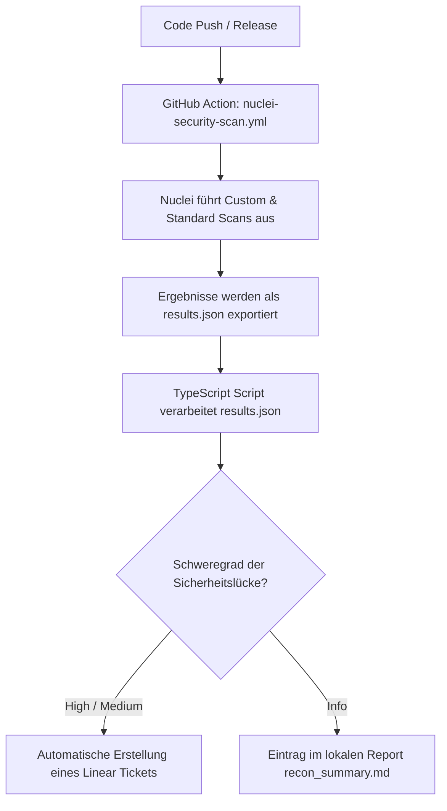

# Sicherheitskonzept: Automatisierte Pentest-Pipeline (EINT-103) mit Nuclei & Linear

Dieses Dokument beschreibt das Konzept, den Projektplan, die Machbarkeit und die Integration einer kontinuierlichen Sicherheitsüberprüfung der Panos.ai Infrastruktur mittels **Nuclei** und **Linear** im Rahmen des Tickets **EINT-103**.

---

## 1. Scope (Geltungsbereich) & Machbarkeit

### Scope
Der Fokus der automatisierten Scans liegt auf drei Hauptbereichen der Panos.ai Infrastruktur:
1. **Frontend (Next.js / Supastarter Template):**
   - Schutz vor dem Leaken von `.env`-Dateien in Produktion.
   - Entdecken von Source Maps (`.js.map`), die internen Code offenlegen.
   - Erkennung von API-Token-Leaks in clientseitigen JavaScript-Bundles.
2. **Backend API (Hono):**
   - Überprüfung auf CORS-Fehlkonfigurationen (`Access-Control-Allow-Origin: *`).
   - Fehlende oder unvollständige Security-Header (HSTS, CSP, X-Content-Type-Options).
   - Fuzzing von Endpunkten auf unautorisierten Zugriff.
3. **Cloud Infrastructure (AWS & Third-Party):**
   - Prüfung auf öffentlich exponierte S3-Buckets.
   - Subdomain Takeovers (Route 53 / Amplify).
   - Sicherheitslücken in genutzten Drittanbieter-Tools (z. B. Metabase RCE-Schachstellen).

### Machbarkeit
- **Technisch einfach umsetzbar:** Nuclei benötigt keine Agenten-Installationen auf den Zielsystemen. Es läuft als schlankes CLI-Tool, das HTTP-Anfragen sendet.
- **CI/CD-Integration:** Da Nuclei als Docker-Image oder über GitHub Actions ausführbar ist, kann es nahtlos in bestehende Deployments integriert werden.
- **Ressourcenschonend:** Scans dauern in der Regel unter 2 Minuten, da Profile auf den spezifischen Tech-Stack (Next.js, Hono, AWS) zugeschnitten sind (Ausschluss irrelevanter Scans wie WordPress oder PHP).

> [!IMPORTANT]
> **Staging vs. Produktion:**
> Sicherheitsüberprüfungen mittels Nuclei werden **ausschließlich** auf Staging-Umgebungen durchgeführt. Das Ausführen aktiver Fuzzing- oder Schwachstellen-Scans gegen die Live-Produktionsdatenbank (z. B. Supabase/RDS) oder Metabase-Instanzen birgt Risiken für die Systemverfügbarkeit und könnte Daten korrumpieren. Eine strikte Trennung stellt sicher, dass Produktionssysteme unbeeinträchtigt bleiben und Testdaten nicht verfälscht werden.

---

## 2. Warum das Tool "Nuclei"?

Nuclei bietet im Vergleich zu klassischen Sicherheits-Scannern entscheidende Vorteile:
- **Deklarative YAML-Templates:** Sicherheitsprüfungen werden als YAML-Dateien geschrieben. Das macht sie extrem lesbar für Entwickler und leicht erweiterbar.
- **Geschwindigkeit & Effizienz:** In Go geschrieben und auf massiv parallele Netzwerkzugriffe optimiert.
- **Hohe Anpassbarkeit:** Wir können eigene Regeln schreiben, die exakt zu unserem Code-Muster passen (z. B. Suche nach dem spezifischen Muster von Linear-API-Schlüsseln `lin_api_*`).
- **Pipeline-Kompatibilität:** Nuclei gibt strukturierte JSON-Dateien aus, die einfach per Script (Node.js/TypeScript) verarbeitet und in andere Tools (wie Linear) importiert werden können.

---

## 3. NIST Cybersecurity Framework (CSF) Alignment

Die Implementierung dieser Pipeline trägt direkt zur Einhaltung des **NIST CSF (Version 2.0)** bei:

```
┌────────────────────────────────────────────────────────┐
│                   NIST CSF ALIGNMENT                   │
├──────────────┬──────────────┬──────────────┬───────────┤
│   IDENTIFY   │   PROTECT    │    DETECT    │  RESPOND  │
│ (Identität)  │   (Schutz)   │ (Erkennung)  │(Reaktion) │
└──────┬───────└──────┬───────└──────┬───────└─────┬─────┘
       │              │              │             │
       ▼              ▼              ▼             ▼
  Sicherheits-   Verhinderung   Regelmäßige   Automatische
  Lücken im      von Secrets-   Scans in der  Ticket-Erstellung
  Tech-Stack     Leaks in       CI/CD-        in Linear für
  erkennen       JS-Bundles     Pipeline      schnellen Fix
```

* **Identify (ID):** Wir identifizieren Schwachstellen und Fehlkonfigurationen in unseren Assets (Next.js, Hono, AWS) und priorisieren sie nach Schweregrad.
* **Protect (PR):** Durch das Scannen von Client-Bundles verhindern wir aktiv, dass sensible API-Schlüssel (z. B. AWS, Hubspot, Linear) nach außen dringen.
* **Detect (DE):** Kontinuierliche Sicherheitsüberprüfungen als Teil des CI/CD-Prozesses erkennen Schwachstellen sofort bei jedem neuen Release.
* **Respond (RS):** Die direkte Integration mit Linear sorgt für eine sofortige Escalation an das Entwickler-Team. Gefundene Schwachstellen werden automatisch in das Entwickler-Board eingepflegt.

---

## 4. Secrets-Management, Autorisierung & Rechtlicher Rahmen

### Secrets-Management
Zur Absicherung der sensiblen API-Schlüssel werden folgende Standards implementiert:
- **GitHub Secrets:** Anmeldedaten wie der `LINEAR_API_KEY` und die `LINEAR_TEAM_ID` dürfen unter keinen Umständen im Repository eingecheckt werden. Sie werden als verschlüsselte Repository-Secrets in GitHub Actions hinterlegt und zur Laufzeit als Umgebungsvariablen an das Integrations-Skript übergeben.

### Empfohlener AWS OIDC-Workflow
Um langfristige AWS-Zugangsdaten (AWS Access Key ID & Secret Access Key) zu vermeiden, empfehlen wir für AWS-Infrastrukturprüfungen den **AWS OIDC (OpenID Connect) Workflow**:
- GitHub Actions authentifiziert sich direkt über einen vordefinierten OpenID Connect Identity Provider bei AWS IAM.
- GitHub Actions fordert eine kurzlebige, temporäre Session-Rolle (AssumeRoleWithWebIdentity) an.
- Diese Rolle besitzt ausschließlich Leserechte (ReadOnly) auf die zu überprüfenden Ressourcen (z. B. S3 Bucket Configurations, Route 53 DNS). Dadurch entfällt das Risiko von credential leaks vollständig.

### Rechtlicher Rahmen
- **Owner Consent & Scope:** Automatisierte Scans dürfen rechtlich nur gegen Server und domains ausgeführt werden, für die Panos.ai die explizite Eigentümerschaft besitzt und für die ein schriftliches Einverständnis der Geschäftsführung / des CTOs vorliegt.
- **Konformität (Deutschland/EU):** Unberechtigtes Scannen fremder Systeme fällt unter § 202a StGB (Ausspähen von Daten) oder entsprechende EU-Richtlinien. Unsere Pipeline läuft durch die Beschränkung auf eigene Staging-Umgebungen in einem sicheren, legalen Rahmen.

---

## 5. Projekt-Struktur (Alignment mit `ext-interns-cybersecurity`)

Um eine saubere Abgrenzung zwischen den verschiedenen Sicherheits-Tools (z. B. Nuclei, Nmap, Trivy) bezüglich Konfiguration, Dokumentation und Output zu gewährleisten, erfolgt die Integration in die Verzeichnisstruktur des zentralen `ext-interns-cybersecurity`-Repositorys wie folgt:

```
ext-interns-cybersecurity/
├── .github/
│   └── workflows/
│       ├── nuclei-security-scan.yml    # Dedizierter Workflow für Nuclei-Scans
│       └── [andere-tools]-scan.yml     # Workflows anderer Tools (sauber getrennt)
└── 2_Identify/
    └── ID.RA-1_Risk_Assessment/
        └── Pentesting/
            ├── README.md               # Gesamt-Dokumentation & Übersicht der Tools
            └── nuclei/                 # Eigener Ordner für alle Nuclei-Assets
                ├── README.md           # Nuclei-spezifische Anleitung & Setup-Info
                ├── templates/          # Custom Nuclei Templates (YAML)
                │   ├── js-bundle-token-leakage.yaml
                │   ├── panos-hono-security-headers.yaml
                │   └── panos-nextjs-config-leak.yaml
                ├── scripts/            # Automatisierungs- & Parser-Skripte
                │   ├── nuclei-to-linear.ts
                │   └── list-teams.ts
                ├── package.json
                └── .gitignore          # Ignoriert lokale result.json & .env-Dateien
```

### Vorteile dieser Struktur (Abstimmung mit @rené):
- **Kein Tool-Clutter:** Configs, Parser und Hilfsskripte von Nuclei liegen isoliert im `nuclei/`-Unterordner und überschneiden sich nicht mit anderen Security-Tools im `Pentesting/`-Verzeichnis.
- **Modulare CI/CD Workflows:** Im Verzeichnis `.github/workflows/` wird für jedes Tool ein separater Workflow (z. B. `nuclei-security-scan.yml`) definiert. Dies ermöglicht es, Scans unabhängig voneinander nach verschiedenen Triggern (z. B. Code Push vs. wöchentlicher Cron) auszuführen.
- **Strikte Output-Separation:** Zwischenergebnisse und Reports werden entweder direkt ins Linear-Board exportiert oder lokal im Tool-Verzeichnis (`recon_summary.md`) abgelegt. Es gibt kein gemeinsames, ungeordnetes "Output-Verzeichnis".

### Implementierungs-Workflow (CI/CD)



---

## 6. Ergebnisse, Verwertung & CI/CD-Gating

Um Ticket-Spam im Entwickler-Board zu vermeiden und kritische Releases abzusichern, werden Ergebnisse von Nuclei anhand der folgenden Matrix bewertet:

### CI/CD-Gating-Tabelle

| Schweregrad (Severity) | Exit-Code | Build-Status | Aktion (Linear / Reporting) | Dringlichkeit (SLA) |
| :--- | :---: | :--- | :--- | :--- |
| **Critical** | `1` | ❌ Blockiert (Hard Fail) | Sofortige Ticket-Erstellung in Linear | Sofortige Behebung (< 24 Std.) |
| **High** | `1` | ❌ Blockiert (Hard Fail) | Sofortige Ticket-Erstellung in Linear | Behebung innerhalb von 3 Tagen |
| **Medium** | `0` | ⚠️ Warnung (Soft Fail) | Automatische Ticket-Erstellung in Linear | Behebung im nächsten Sprint |
| **Low** | `0` | ✅ Erfolgreich | Eintrag in `recon_summary.md` | Überprüfung bei Bedarf |
| **Info** | `0` | ✅ Erfolgreich | Eintrag in `recon_summary.md` | Keine Behebung erforderlich |

- **Deduplizierung:** Das Skript prüft vor der Erstellung eines Tickets in Linear stets, ob bereits ein offenes Ticket mit demselben Titel existiert, um Redundanzen zu vermeiden.

---

## 7. Projektplan & Meilensteine (Aktivitäten für EINT-103)

Für die Überwachung des Bearbeitungsfortschritts der verbleibenden Wochen deines Praktikums wurden die folgenden Meilensteine in Linear angelegt:

### Woche 1: Fundament & Scoping
* **Meilenstein 1.1: Nuclei CLI Setup & Basics**
  - Installation und grundlegendes Verständnis der CLI-Parameter.
* **Meilenstein 1.2: Scope-Definition & Target-Liste**
  - Definition der Staging-Umgebungen und zu testenden URLs.
* **Meilenstein 1.3: Baseline Scan & Filterung**
  - Erster vollständiger Durchlauf und Analyse von False Positives.

### Woche 2: Custom Templates & Tech-Stack-Fokus
* **Meilenstein 2.1: Next.js & Supastarter Templates**
  - Erstellung von Templates für exponierte Konfigurationsdateien und JS-Bundles.
* **Meilenstein 2.2: Hono API Security-Header & CORS**
  - Erstellung von Templates zur Überprüfung der Backend-Sicherheitsarchitektur.
* **Meilenstein 2.3: Cloud Infrastruktur-Scans**
  - Metabase CVE-Scans und AWS-S3-Bucket-Prüfungen.

### Woche 3: Automatisierung & Linear-Integration
* **Meilenstein 3.1: Parsing & Filtering Script**
  - Entwicklung des Skripts zur Strukturierung der JSON-Outputs.
* **Meilenstein 3.2: Linear SDK & Deduplizierung**
  - Anbindung an das Linear-Board und Schutz vor doppelten Tickets (EINT-103 Integration).
* **Meilenstein 3.3: CI/CD-Pipeline Automation**
  - Integration als GitHub Action für regelmäßige automatische Scans.
* **Meilenstein 3.4: Dokumentation & Abschlusspräsentation**
  - Erstellung des Benutzerhandbuchs und Vorstellung des Systems.

---

## 8. Go-Live-Checkliste

Vor dem vollständigen Rollout der Pentest-Pipeline in der CI/CD-Pipeline müssen die folgenden Schritte abgearbeitet sein:

- [ ] **1. Schriftliche Freigabe (CTO/Management):** Einholen der formellen Genehmigung für das Scannen der definierten Domains.
- [ ] **2. Targets verifizieren:** Bestätigen, dass ausschließlich Staging-Endpunkte in der Target-Liste hinterlegt sind (Ausschluss der Produktions-Targets).
- [ ] **3. Secrets in GitHub hinterlegen:** Speichern des `LINEAR_API_KEY` und der `LINEAR_TEAM_ID` in den verschlüsselten GitHub Repository Secrets.
- [ ] **4. AWS OIDC konfigurieren:** Einrichtung des OpenID Connect Identity Providers und IAM Role Assumption in AWS für die passwortlose Authentifizierung.
- [ ] **5. False Positive Profile anlegen:** Konfiguration der Filter für bekannte, akzeptierte Befunde, um Rauschen im Reporting zu verhindern.
- [ ] **6. Sync-Skript testen:** Manueller Testlauf des `nuclei-to-linear.ts` Skripts und Validierung der Deduplizierung im Linear Board.
- [ ] **7. GitHub Actions Workflow aktivieren:** Einspielen der `.github/workflows/nuclei-security-scan.yml` und Test des Schedule-Crons.
- [ ] **8. Team benachrichtigen:** Entwickler und Systemadministratoren über die geplanten Scan-Zeitpunkte informieren, um Verwirrungen im Monitoring zu vermeiden.
