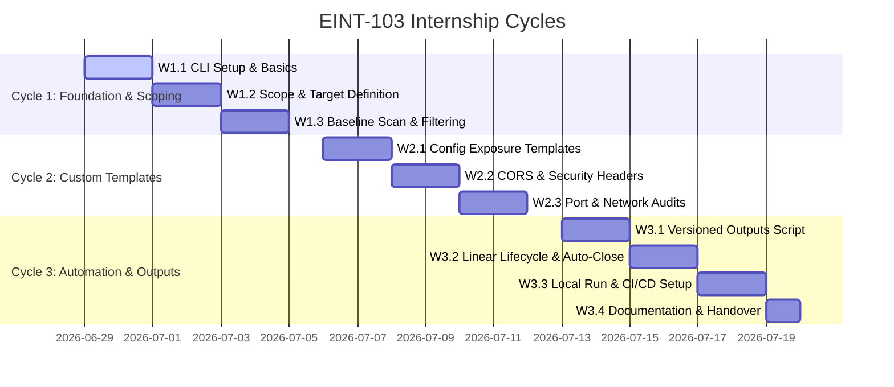

# 📋 EINT-501: Milestone Plan for EINT-103 (Nuclei Pipeline)

> **EINT-501 Task:** *Create a milestone-based plan with activities over the remaining weeks of your internship for EINT-103 with Nuclei.*

This document is the deliverable for **EINT-501**. It defines the timeline, milestones, cycles, and acceptance criteria for the internship work on **[EINT-103: Automated Pentest Pipeline (Nuclei & Linear)](docs/eint-103-nuclei-pipeline.md)**.

For the full technical specification (scope, Nuclei vs. ZAP, Linear lifecycle, severity matrix), see [docs/eint-103-nuclei-pipeline.md](eint-103-nuclei-pipeline.md).

---

## 1. Context

| Field | Value |
|---|---|
| **Parent Project** | EINT-103: Automated Pentest Pipeline (Nuclei & Linear) |
| **Intern** | @René |
| **Owner / Maintainer** | @Frank |
| **Duration** | 3 weeks (June 29 – July 19, 2026) |
| **Linear Project** | `EINT-103: Nuclei DevSecOps Pipeline` |
| **Parent Issue** | `[ID.RA-1] EINT-103: Automated Pentest Pipeline (Nuclei & Linear)` |

---

## 2. Linear Project & Issue Organization

All work is tracked in the Linear project **"EINT-103: Nuclei DevSecOps Pipeline"** under a single parent issue aligned with the NIST CSF framework (ID.RA-1 Risk Assessment).

### Hierarchy

```
Project: EINT-103: Nuclei DevSecOps Pipeline
│
└── Parent Issue: [ID.RA-1] EINT-103: Automated Pentest Pipeline (Nuclei & Linear)
    ├── [DevSecOps] W1.1: Nuclei CLI Setup & Basics           → Cycle 1
    ├── [DevSecOps] W1.2: Scope-Definition & Target-Liste      → Cycle 1
    ├── [DevSecOps] W1.3: Baseline Scan & Filterung            → Cycle 1
    ├── [DevSecOps] W2.1: Custom Templates (Config Exposure)   → Cycle 2
    ├── [DevSecOps] W2.2: Custom Templates (CORS & Headers)    → Cycle 2
    ├── [DevSecOps] W2.3: Port & Network Audits                → Cycle 2
    ├── [DevSecOps] W3.1: Versioned Outputs Script             → Cycle 3
    ├── [DevSecOps] W3.2: Linear Lifecycle & Auto-Close        → Cycle 3
    ├── [DevSecOps] W3.3: Local Run & CI/CD Setup              → Cycle 3
    └── [DevSecOps] W3.4: Documentation & Handover             → Cycle 3
```

### Labels
| Label | Color | Purpose |
|---|---|---|
| `milestone` | 🔵 Blue | Applied to planning/milestone sub-issues |
| `nuclei-scan` | 🔴 Red | Applied to auto-created scan findings |

### Workflow States
`Triage` → `Backlog` → `Todo` → `In Progress` → `Done`

---

## 3. Cycles & Timeline



### Cycle 1: Foundation & Scoping (June 29 – July 5)

| Milestone | Dates | Deliverables | Acceptance Criteria |
|---|---|---|---|
| **W1.1** CLI Setup & Basics | June 29–30 | Nuclei installed, basic commands tested | Intern can run `nuclei -h` and execute a scan against a safe demo target |
| **W1.2** Scope-Definition & Target-Liste | July 1–2 | `targets.txt` with staging URLs | Target list reviewed by @Frank, contains only staging endpoints |
| **W1.3** Baseline Scan & Filterung | July 3–5 | First full scan results, false positive list | `results.json` generated, known false positives documented |

### Cycle 2: Custom Templates (July 6 – July 12)

| Milestone | Dates | Deliverables | Acceptance Criteria |
|---|---|---|---|
| **W2.1** Config Exposure Templates | July 6–7 | `templates/panos-config-exposure.yaml` | Template detects `.env` exposure on staging (tested) |
| **W2.2** CORS & Security Headers | July 8–9 | `templates/panos-hono-security-headers.yaml` | Template detects missing HSTS/CSP and CORS wildcards |
| **W2.3** Port & Network Audits | July 10–12 | Port scan templates | Exposed services on staging ports identified |

### Cycle 3: Automation & Outputs (July 13 – July 19)

| Milestone | Dates | Deliverables | Acceptance Criteria |
|---|---|---|---|
| **W3.1** Versioned Outputs Script | July 13–14 | Updated `nuclei-to-linear.ts` | Each run creates `outputs/scan_YYYY-MM-DD_HH-mm-ss/` with `results.json` + `recon_summary.md` |
| **W3.2** Linear Lifecycle & Auto-Close | July 15–16 | Dedup + auto-close logic | Duplicate tickets prevented; resolved vulns auto-close in Linear |
| **W3.3** Local Run & CI/CD Setup | July 17–18 | `.env.example`, workflow YAML | Intern can run full pipeline locally; CI/CD workflow exists |
| **W3.4** Documentation & Handover | July 19 | README, template docs, presentation | Documentation enables future maintenance without onboarding |

---

## 4. Dependencies & Blockers

| Dependency | Owner | Status | Mitigation |
|---|---|---|---|
| Staging target URLs | @Frank | ⏳ Pending | Scans blocked until URLs provided |
| Linear API key | Self-service | ✅ Available | Interns generate personal tokens (see EINT-103 §3) |
| Legal consent for scanning | CTO / Management | ⏳ Pending | Required before any staging scans |
| Frank availability | @Frank | Variable | Local-first execution model — work continues offline |

---

## 5. Acceptance Criteria (EINT-501)

This milestone plan (EINT-501) is considered **complete** when:

- [ ] All 10 milestone issues are created in Linear under the EINT-103 project
- [ ] Issues are organized into 3 Cycles with correct date ranges
- [ ] Parent issue `[ID.RA-1] EINT-103` links all sub-issues
- [ ] Labels `milestone` and `nuclei-scan` are configured on the team board
- [ ] Workflow includes `Triage` state
- [ ] Technical specification exists in `docs/eint-103-nuclei-pipeline.md`
- [ ] Both documents are pushed to GitHub in the `docs/` folder
