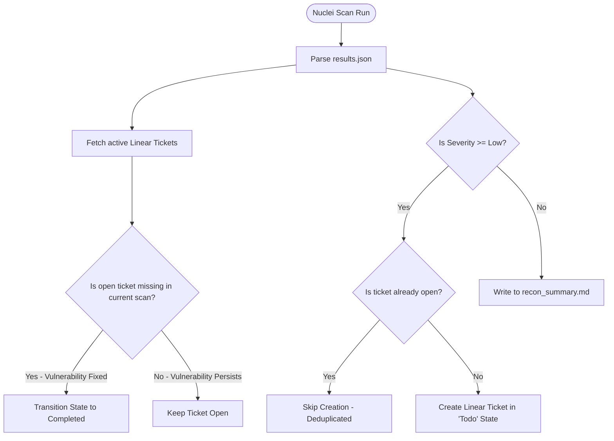
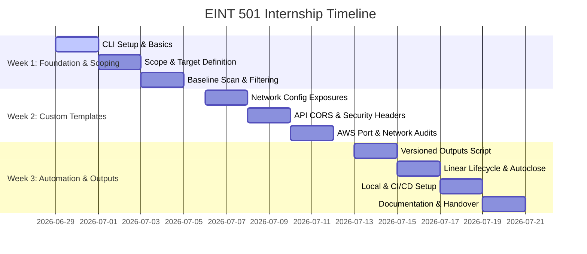

# 📋 EINT 501: Automated Pentest Pipeline (Nuclei & Linear)
## Milestone-Based Internship Plan & Repository Alignment

---

> [!NOTE]
> **Project Context:** This document establishes the milestone-based plan, execution model, and directory structure for the remaining weeks of the internship focused on **EINT 501 (Automated Pentest Pipeline with Nuclei & Linear)**.
> **Key Stakeholders:** @René (Intern) and @Frank (Repository Owner/Maintainer).

---

## 🎯 1. Plan Overview & Refocused Scope

The objective of EINT 501 is to establish a continuous, network-facing security scanning pipeline for Panos.ai's AWS staging environments using **Nuclei** and integrate findings directly into the developers' workflow via **Linear**.

### 🔍 Target Scope Boundaries
To align with staging environment constraints and ZAP-tailored penetration testing requirements, the scope is restricted strictly to network-facing endpoints:

```
┌────────────────────────────────────────────────────────┐
│                    PROJECT SURFACE                     │
├───────────────────────────┬────────────────────────────┤
│         IN SCOPE          │        OUT OF SCOPE        │
├───────────────────────────┼────────────────────────────┤
│ • AWS Staging Endpoints   │ • Local Next.js source code│
│ • Staging APIs (Hono)     │ • Local source map parsing │
│ • Network exposed configs │ • Metabase CVE scans       │
│ • Active HTTP/HTTPS audits│ • Production environments  │
└───────────────────────────┴────────────────────────────┘
```

* **Active Network Auditing:** Focus on scanning network-exposed staging assets for CORS misconfigurations, missing security headers (HSTS, CSP), and HTTP config file exposures.
* **Strict Environment Isolation:** Scans run exclusively against isolated staging systems to prevent availability disruption or data corruption on production databases.

---

## 💻 2. Execution Environment & Dependency Gating

To bypass blocking dependencies when the repository owner (@Frank) is unavailable, the pipeline is designed with a **Local-First Execution** fallback:

### ⚙️ Runner & Execution Locations
1. **Primary - Local Workstations (Offline Fallback):**
   - Interns execute scans locally on their development machines targeting the staging URLs.
   - **Credentials Management:** Interns generate personal API developer tokens in their Linear profiles and place them in a local, git-ignored `.env` file.
   - **Execution Command:** Interns trigger scans using the local CLI and sync issues using `npm run sync-tickets`.
2. **Secondary - GitHub Actions CI/CD Runner (Automated Execution):**
   - When @Frank is available, scans are automated via GitHub Actions using repository secrets (`LINEAR_API_KEY`, `LINEAR_TEAM_ID`).
   - Run logs are archived automatically in the repository run history.

---

## 📂 3. Directory Layout & Versioned Outputs

To maintain a clean repository structure and support multiple scan runs without overwriting past results, the central `ext-interns-cybersecurity` repository is organized as follows:

```yaml
ext-interns-cybersecurity/
├── .github/
│   └── workflows/
│       ├── nuclei-security-scan.yml    # 🔧 CONFIG: Dedicated CI/CD scan workflow for Nuclei
│       └── zap-security-scan.yml       # 🔧 CONFIG: Dedicated ZAP scans workflow
└── 2_Identify/
    └── ID.RA-1_Risk_Assessment/
        └── Pentesting/
            ├── README.md               # 📖 DOCS: Overview of all active tools & scope
            └── nuclei/                 # 📂 ISOLATION: Dedicated directory for Nuclei
                ├── README.md           # 📖 DOCS: Setup & custom template documentation
                ├── package.json        # 🔧 CONFIG: Node.js packages & sync scripts
                ├── tsconfig.json       # 🔧 CONFIG: TypeScript compiler settings
                ├── .gitignore          # 🔧 CONFIG: Ignored local credentials/raw files
                ├── templates/          # 🔧 CONFIG: Custom network-based YAML templates
                │   ├── panos-hono-security-headers.yaml
                │   └── panos-nextjs-config-leak.yaml
                ├── upload/             # 📂 UPLOAD: Dedicated integration / upload scripts
                │   ├── nuclei-to-linear.ts # Script syncing outputs to Linear (with Auto-Close)
                │   ├── list-teams.ts       # Utility to find Linear team IDs
                │   └── create-milestone-issues.ts # Seeding helper for roadmap issues
                └── outputs/            # 📝 OUTPUT: Versioned scan reports (Run-by-Run)
                    ├── .gitkeep
                    └── scan_YYYY-MM-DD_HH-mm-ss/  # Unique run folder
                        ├── results.json      # Raw JSON scan output for this run
                        └── recon_summary.md  # Run-specific report of low/info issues
```

### 📦 Output Organization
* **Timestamped Subfolders:** Every scan run creates a directory under `outputs/scan_YYYY-MM-DD_HH-mm-ss/`.
* **results.json:** Contains the raw findings generated by Nuclei.
* **recon_summary.md:** Contains a markdown table detailing all low-severity or informational discoveries for the run.
* **Git Safety:** High-volume scan logs (`outputs/scan_*`) are excluded via `.gitignore` to prevent repository bloat, while `outputs/` folder structure is preserved via `.gitkeep`.

---

## 🎟️ 4. Linear Ticket Lifecycle & Management

The integration script [nuclei-to-linear.ts](file:///Users/tk/.gemini/antigravity/scratch/panos-ai-pentest/upload/nuclei-to-linear.ts) automatically synchronizes and manages issues inside the Linear workspace using a stateful flow:



### 📋 Lifecycle Logic & States
* **Target Board:** Configured via `LINEAR_TEAM_ID` in `.env` (points to the target developer or cybersecurity team board).
* **Issue Format:** Titles follow `[Nuclei] <Vulnerability Name> an <Target URL>` to ensure uniqueness.
* **Triage State:** Newly detected issues start in the `Todo` state with a `Security` tag.
* **Severity Mapping:** Severity levels map directly to Linear priority settings:
  - `Critical` $\rightarrow$ Priority 1 (Urgent)
  - `High` $\rightarrow$ Priority 2 (High)
  - `Medium` $\rightarrow$ Priority 3 (Normal)
  - `Low` $\rightarrow$ Priority 4 (Low)
* **Deduplication:** The script queries all active, non-completed issues on the target board. If an issue with a matching title exists, ticket creation is skipped.
* **Vulnerability Auto-Close:** If a previously reported vulnerability is fixed and no longer detected in subsequent runs, the script automatically moves the corresponding Linear issue to `Completed` (e.g., `Done` or `Completed`).

---

## 📅 5. Timeline & Milestone-Based Plan

The internship plan spans **3 weeks** starting from **June 29, 2026**.



### 🗓️ Week 1: Foundation, Scoping & Baseline Scanning (June 29 – July 5, 2026)
* **Focus:** Master Nuclei CLI, map staging environment targets, and establish a scan baseline.
* **Milestones:**
  * **`[M1.1]` CLI Setup & Basics (June 29 – June 30):** Installation of Nuclei CLI and testing basic syntax/commands.
  * **`[M1.2]` Scope-Definition & Target List (July 1 – July 2):** Define AWS staging endpoints (no local code, no Metabase) and compile target lists.
  * **`[M1.3]` Baseline Scan & Filtering (July 3 – July 5):** Run standard templates, filter false positives, and configure baseline network scan profiles.

### 🗓️ Week 2: Custom Templates & Network-Audits (July 6 – July 12, 2026)
* **Focus:** Write customized network-facing YAML templates tailored specifically to Panos.ai's AWS staging stack.
* **Milestones:**
  * **`[M2.1]` HTTP Config Exposure Templates (July 6 – July 7):** Develop templates to scan staging URLs for exposed configuration files (e.g. `.env` file exposure over the network).
  * **`[M2.2]` Hono API CORS & Security Headers (July 8 – July 9):** Target staging API routes, testing for CORS wildcard policies (`Access-Control-Allow-Origin: *`) and missing security headers (HSTS, CSP, X-Frame-Options).
  * **`[M2.3]` Port & Staging Infrastructure Audits (July 10 – July 12):** Write templates to scan staging infrastructure ports and detect exposed network services.

### 🗓️ Week 3: Automation, Linear Lifecycle & Versioning (July 13 – July 19, 2026)
* **Focus:** Automate scan execution, script Linear auto-closing ticket logic, enable offline execution, and package outputs.
* **Milestones:**
  * **`[M3.1]` Versioned Outputs Script (July 13 – July 14):** Script in TypeScript to run scans and write findings into dated subfolders under `outputs/scan_timestamp/`.
  * **`[M3.2]` Linear Lifecycle Integration (July 15 – July 16):** Develop logic in `nuclei-to-linear.ts` to automatically create/deduplicate active findings, and auto-close tickets in Linear when a finding is resolved (no longer detected).
  * **`[M3.3]` Local Run & Offline Support (July 17 – July 18):** Configure local setup configurations allowing interns to run scans and sync scripts via personal API tokens when Frank (the owner) is unavailable.
  * **`[M3.4]` Documentation & Handover (July 19):** Complete README setup files, document custom templates, and conduct final project handover.

---

## 🚦 6. CI/CD Build-Gating & SLA Matrix

Vulnerabilities found by Nuclei are categorized as follows to automate build gating and dictate ticket resolution urgency:

| Severity | Exit Code | Build Status | Action | SLA (Resolution Time) |
| :--- | :---: | :--- | :--- | :--- |
| 🔴 **Critical** | `1` | ❌ Hard Fail | Create Linear Ticket | Immediate (< 24 hours) |
| 🟠 **High** | `1` | ❌ Hard Fail | Create Linear Ticket | Within 3 Days |
| 🟡 **Medium** | `0` | ⚠️ Soft Fail (Warning) | Create Linear Ticket | Next Sprint |
| 🔵 **Low** | `0` | ✅ Success | Create Linear Ticket | Backlog Triage |
| ⚪ **Info** | `0` | ✅ Success | Log in `recon_summary.md` | Informational only |

---

## ✅ 7. Success Criteria

The internship project is considered complete when:
- Automated staging security scans execute successfully.
- Low and informational findings are documented locally in timestamped run reports.
- Actionable findings (Critical, High, Medium, Low) successfully create and sync issues on the Linear team board.
- Clean auto-closing logic is verified: resolving a vulnerability automatically closes the corresponding Linear ticket.
- Offline support is verified: scans and synchronization run locally on intern machines using personal Linear API keys.

---

## 🏁 8. Go-Live Checklist

- [ ] **1. Legal Consent:** Obtain written sign-off from CTO/Management for scanning the staging targets.
- [ ] **2. Scope Verification:** Verify that targets contain only staging network URLs (no local directories, no production IPs).
- [ ] **3. Local Fallback Test:** Confirm that interns can execute scans locally and sync to Linear using personal developer tokens.
- [ ] **4. GitHub Secrets Setup:** Securely add `LINEAR_API_KEY` and `LINEAR_TEAM_ID` in GitHub Secrets.
- [ ] **5. AWS OIDC Setup:** Configure OIDC workflow roles to enable credentials-free AWS audits.
- [ ] **6. Output Versioning Dry Run:** Verify that the runner successfully creates `outputs/scan_YYYY-MM-DD_HH-mm-ss/` and saves raw JSON plus Markdown summaries.
- [ ] **7. Linear Auto-Close Dry Run:** Execute the script against a resolved vulnerability and confirm the corresponding Linear issue transitions to `Completed`.
- [ ] **8. Team Notification:** Inform developers of the testing schedules to avoid alerting issues in AWS logs.
