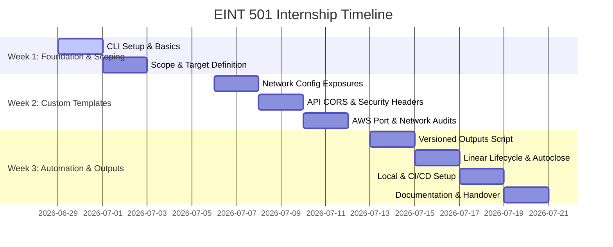

# 📋 EINT 501: Milestone-Based Internship Plan & Repository Alignment (Nuclei)

This document establishes the milestone-based plan for the remaining weeks of the internship focused on **EINT 501 (Automated Pentest Pipeline with Nuclei & Linear)**, aligned with **@René** (Intern) and **@Frank** (Repository Owner/Maintainer).

---

## 🎯 Plan Overview

The goal of this internship project is to implement a continuous security scanning pipeline for Panos.ai's network-facing staging environments using **Nuclei** and integrate the findings directly into the developers' workflow via **Linear**.

### Key Objectives
1. **Targeted Scanning:** Scan AWS staging network endpoints (Webapps, API backends) using custom-tuned and standard Nuclei templates. (Note: No local code scanning, no Metabase auditing as they are out of the staging scope).
2. **Linear Integration:** Parse Nuclei outputs, automatically create tickets, and automatically close/resolve resolved vulnerabilities in Linear.
3. **Local & CI/CD Automation:** Enable both local manual runs (when the owner is offline) and automated CI/CD schedules via GitHub Actions.
4. **Output Versioning:** Organise scan outputs into dated folders (`outputs/scan_YYYY-MM-DD_HH-mm-ss/`) to maintain execution history.

---

## 📅 Timeline & Milestone-Based Plan

The internship plan spans **3 weeks** starting from **June 29, 2026**.



### 🗓️ Week 1: Foundation, Scoping & Baseline Scanning (June 29 – July 5, 2026)
* **Focus:** Master Nuclei CLI, map staging targets (AWS deployed endpoints only), and establish a scan baseline.
* **Milestones:**
  * **`[M1.1]` CLI Setup & Basics (June 29 – June 30):** Installation of Nuclei CLI and testing basic syntax/commands against safe demo environments.
  * **`[M1.2]` Scope-Definition & Target List (July 1 – July 2):** Define AWS staging endpoints (no local code, no Metabase) and compile target lists.
  * **`[M1.3]` Baseline Scan & Filtering (July 3 – July 5):** Run standard templates, filter false positives, and configure baseline network scan profiles.

### 🗓️ Week 2: Custom Templates & Network-Audits (July 6 – July 12, 2026)
* **Focus:** Write customized network-facing YAML templates tailored specifically to Panos.ai's AWS staging stack.
* **Milestones:**
  * **`[M2.1]` HTTP Config Exposure Templates (July 6 – July 7):** Develop templates to scan staging URLs for exposed configuration files (e.g. `.env` file exposure over the network).
  * **`[M2.2]` Hono API CORS & Security Headers (July 8 – July 9):** Target staging API routes, testing for CORS wildcard policies (`Access-Control-Allow-Origin: *`) and missing security headers (HSTS, CSP, X-Frame-Options).
  * **`[M2.3]` Port & Staging Infrastructure Audits (July 10 – July 12):** Write templates to scan staging infrastructure ports and detect exposed network services (excluding Metabase and local AWS backend resources).

### 🗓️ Week 3: Automation, Linear Lifecycle & Versioning (July 13 – July 19, 2026)
* **Focus:** Automate scan execution, script Linear auto-closing ticket logic, enable offline execution, and package outputs.
* **Milestones:**
  * **`[M3.1]` Versioned Outputs Script (July 13 – July 14):** Script in TypeScript to run scans and write findings into dated subfolders under `outputs/scan_timestamp/`.
  * **`[M3.2]` Linear Lifecycle Integration (July 15 – July 16):** Develop logic in `nuclei-to-linear.ts` to automatically create/deduplicate active findings, and auto-close tickets in Linear when a finding is resolved (no longer detected).
  * **`[M3.3]` Local Run & Offline Support (July 17 – July 18):** Configure local setup configurations allowing interns to run scans and sync scripts via personal API tokens when Frank (the owner) is unavailable.
  * **`[M3.4]` Documentation & Handover (July 19):** Complete README setup files, document custom templates, and conduct final project handover.

---

## 🤝 Repository Directory Alignment (with @Frank & @rené)

To ensure a clean separation between various cybersecurity tools (e.g., Nuclei, ZAP, Nmap), the files are organised systematically within the central `ext-interns-cybersecurity` repository.

### Directory Layout

```
ext-interns-cybersecurity/
├── .github/
│   └── workflows/
│       ├── nuclei-security-scan.yml    # 🔧 CONFIG: Dedicated CI/CD scan workflow for Nuclei
│       └── zap-security-scan.yml       # 🔧 CONFIG: Separate workflow for ZAP scans
└── 2_Identify/
    └── ID.RA-1_Risk_Assessment/
        └── Pentesting/
            ├── README.md               # 📖 DOCS: Overview of all active tools & scope
            └── nuclei/                 # 📂 ISOLATION: Dedicated directory for Nuclei
                ├── README.md           # 📖 DOCS: Setup, Local Fallbacks & Template guide
                ├── package.json        # 🔧 CONFIG: Node.js packages & sync scripts
                ├── tsconfig.json       # 🔧 CONFIG: TypeScript compiler settings
                ├── .gitignore          # 🔧 CONFIG: Ignored local credentials/raw files
                ├── templates/          # 🔧 CONFIG: Custom network-based YAML templates
                │   ├── panos-hono-security-headers.yaml
                │   └── panos-nextjs-config-leak.yaml
                ├── upload/             # 📂 UPLOAD: Dedicated integration / upload scripts
                │   ├── nuclei-to-linear.ts # Script syncing outputs to Linear (with Auto-Close)
                │   ├── list-teams.ts       # Utility to find Linear team IDs
                │   └── create-milestone-issues.ts # Seeding helper for roadmap issues
                └── outputs/            # 📝 OUTPUT: Versioned scan reports (Run-by-Run)
                    ├── .gitkeep
                    └── scan_YYYY-MM-DD_HH-mm-ss/
                        ├── results.json      # Raw JSON scan output for the run
                        └── recon_summary.md  # Run-specific report of low/info issues
```

### Separation of Concerns
1. **Configuration & Scripts (Tool Settings & Code):**
   * Configs are stored in `Pentesting/nuclei/templates/` and `Pentesting/nuclei/package.json`.
   * Integration and ticket upload logic is located in the dedicated `upload/` folder.
   * Workflows are placed under `.github/workflows/` (e.g., `nuclei-security-scan.yml`) to keep tools isolated.
2. **Local Run Support (Frank Unavailable):**
   * If Frank (the owner) is unavailable, no AWS or GitHub Actions secrets can be updated.
   * To prevent blockage, the pipeline supports **Local Workstation Execution**. Interns can generate personal Linear tokens, define them in a local `.env` (ignored by git), run the CLI scan, and execute `npm run sync-tickets` to sync findings directly.
3. **Output & Versioning (Outputs folder):**
   * Scan findings are written to dated subfolders in `outputs/scan_YYYY-MM-DD_HH-mm-ss/` keeping execution logs clean and avoiding overwrite issues.
   * Actionable high/critical vulnerabilities are synced directly to Linear.
   * Low/informational findings are written to `outputs/scan_YYYY-MM-DD_HH-mm-ss/recon_summary.md`.

---

## 🎟️ Linear Ticket Lifecycle & Management

The integration script `nuclei-to-linear.ts` manages vulnerabilities using the following detailed lifecycle workflow:

1. **Creation & Status:**
   - Tickets are generated under the team target `LINEAR_TEAM_ID` with status `Todo` and label `Security` or `DevSecOps`.
   - **Ticket Title:** `[Nuclei] <Finding Name> an <Target URL>`.
   - **Description:** Includes template details, host, severity, and matched output headers or payload.
2. **Priority Mapping:**
   - `Critical` $\rightarrow$ Priority 1 (Urgent)
   - `High` $\rightarrow$ Priority 2 (High)
   - `Medium` $\rightarrow$ Priority 3 (Normal)
   - `Low` $\rightarrow$ Priority 4 (Low)
3. **Deduplication:**
   - The script queries all active, non-completed issues on the target board. If an issue with the matching title exists, the script skips creation.
4. **Vulnerability Auto-Close:**
   - When a scan is executed, the script gathers all active `[Nuclei] ` issues in Linear.
   - If an issue is active but the vulnerability is **no longer detected** in the current scan, the script automatically moves the issue state to `Completed` (or resolved state), marking it as fixed.

---

## 🚀 CI/CD Build-Gating & SLA Matrix

Vulnerabilities found by Nuclei are categorized as follows to automate build gating and dictate ticket resolution urgency:

| Severity | Exit Code | Build Status | Action | SLA (Resolution Time) |
| :--- | :---: | :--- | :--- | :--- |
| 🔴 **Critical** | `1` | ❌ Hard Fail | Create Linear Ticket | Immediate (< 24 hours) |
| 🟠 **High** | `1` | ❌ Hard Fail | Create Linear Ticket | Within 3 Days |
| 🟡 **Medium** | `0` | ⚠️ Soft Fail (Warning) | Create Linear Ticket | Next Sprint |
| 🔵 **Low** | `0` | ✅ Success | Log in `recon_summary.md` | As needed |
| ⚪ **Info** | `0` | ✅ Success | Log in `recon_summary.md` | Informational only |

---

## ✅ Success Criteria

The internship project is considered complete when:

- Scheduled scans execute successfully via GitHub Actions.
- Custom templates cover the agreed Panos.ai attack surface.
- High and critical findings automatically create Linear issues.
- Duplicate tickets are prevented.
- False positives are documented and filtered.
- Documentation enables future maintenance without additional onboarding.

---

## 🏁 Go-Live Checklist

- [ ] **1. Legal Consent:** Obtain written sign-off from CTO/Management for scanning the staging targets.
- [ ] **2. Scope Verification:** Verify that targets contain only staging network URLs (no local directories, no production IPs).
- [ ] **3. Local Fallback Test:** Confirm that interns can execute scans locally and sync to Linear using personal developer tokens.
- [ ] **4. GitHub Secrets Setup:** Securely add `LINEAR_API_KEY` and `LINEAR_TEAM_ID` in GitHub Secrets.
- [ ] **5. AWS OIDC Setup:** Configure OIDC workflow roles to enable credentials-free AWS audits.
- [ ] **6. Output Versioning Dry Run:** Verify that the runner successfully creates `outputs/scan_YYYY-MM-DD_HH-mm-ss/` and saves raw JSON plus Markdown summaries.
- [ ] **7. Linear Auto-Close Dry Run:** Execute the script against a resolved vulnerability and confirm the corresponding Linear issue transitions to `Completed`.
- [ ] **8. Team Notification:** Inform developers of the testing schedules to avoid alerting issues in AWS logs.
